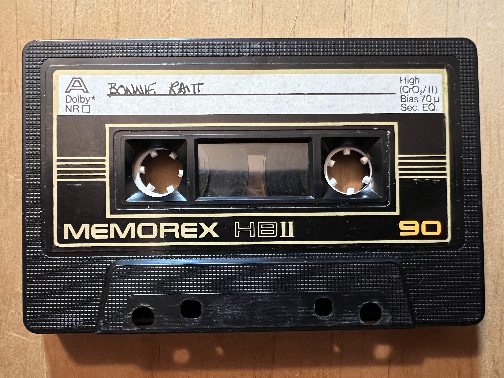

I was raised on Bonnie Raitt and Van Morrison (plus healthy doses of Bach and Vivaldi).

## Side A
- Give it Up or Let Me Go
- I Know
- Love Me Like A Man
- Nothing Seems To Matter
- About To Make Me Leave Home
- Runaway
- Louise
- Angle From Montgomery
- You Gotta Know How
- You Told Me Baby
- Love Has No Pride
- You're Gonna Get What's Coming

## Side B
- Wild For My Baby
- Bluebird
- Mighty Tight Woman
- Thank You
- Finest Lovin' Man
- Any Day Woman
- Big Road
- Walking Blues
- Danger Heartbreak
- Since I Fell For You
- I Ain't Blue
- Woman Be Wise

