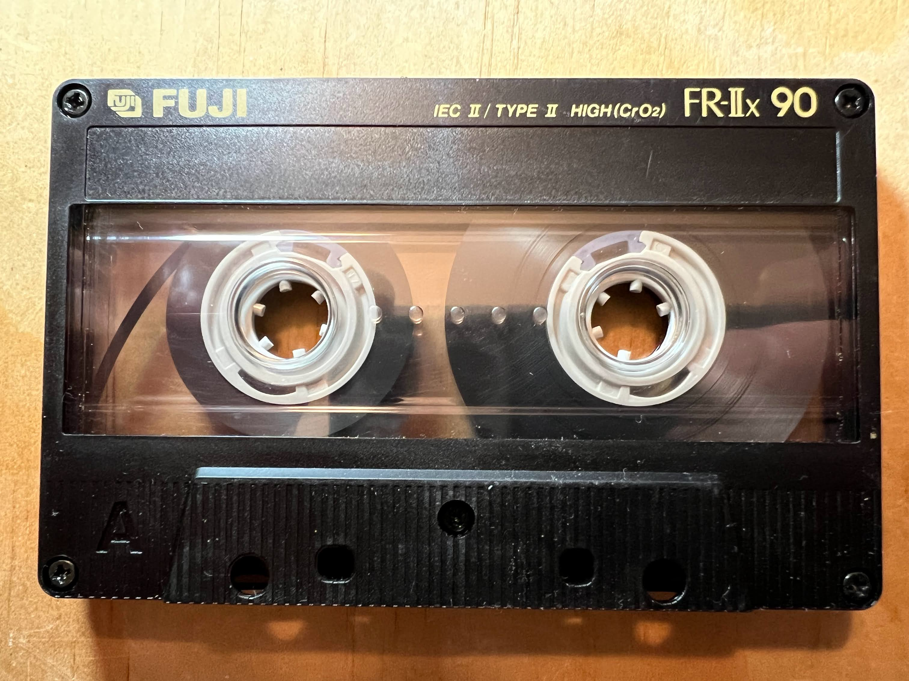

## Side A
- The Road to Hell - Chris Rea
- A Hard Rain's Gonna Fall - Edie Brikell
- What A Wonderful World - David Bromberg
- Roll Another - Number 1
- Albuquerque - Neil Young
- Bella - Carlos Santana
- Cocaine - Jackson Browne
- Stay - David Lindley
- It Never Rains - Dire Straits
- Around the Horn - Souled American
- Hold Back the Tears - Souled American

## Side B
- Star Spangled Banner - Marvin Gaye
- Help the Children - MC Hammer
- Past the Point of Rescue - Mary Black
- Fat Valley of Pain - Mary Black
- I Say a Little Prayer - Mary Black
- Thunderstruck - AC/DC
- Days That Used to - Neil Young
- Nothing Compares 2U - Sinead O'Connor
- Crime in the City - Neil Young
- Into the Great Wide Open - Tom Petty

